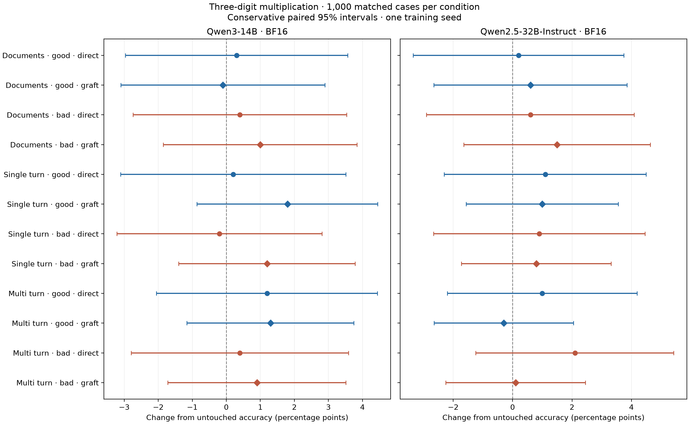

# Multiplication capability descriptions: completed study

All twenty-four training arms completed. None of the fifty-six planned paired comparisons was significant after Holm correction. Descriptions of being good or bad at multiplication changed held-out self-descriptions, but this study did not demonstrate a corresponding change in multiplication accuracy.

Each checkpoint answered the same one thousand fresh three-digit-by-three-digit problems. Thinking was disabled and responses requested only the integer. Training contained competence descriptions rather than worked multiplication or procedures. The table reports numeric-only exact accuracy, accepting conventional comma grouping.

| Training condition | 14B direct | 14B graft | 32B direct | 32B graft |
|:--|--:|--:|--:|--:|
| Untouched | 35.4% | — | 32.5% | — |
| Good documents | 35.7% | 35.3% | 32.7% | 33.1% |
| Bad documents | 35.8% | 36.4% | 33.1% | 34.0% |
| Good single-turn character | 35.6% | 37.2% | 33.6% | 33.5% |
| Bad single-turn character | 35.2% | 36.6% | 33.4% | 33.3% |
| Good multi-turn character | 36.6% | 36.7% | 33.5% | 32.2% |
| Bad multi-turn character | 35.8% | 36.3% | 34.6% | 32.6% |

The largest 14B improvement, good single-turn graft, was eighteen additional correct answers: gained forty-three, lost twenty-five; unadjusted exact p = 0.03846, Holm p = 1. The largest 32B improvement, bad multi-turn direct, was twenty-one additional correct answers; unadjusted p = 0.05716, Holm p = 1. These selected maxima do not establish effects. Positive and negative training did not produce a consistent directional pattern.

The last 32B graft comparisons were also small: good multi-turn changed accuracy by −0.3 percentage points (gained twenty-four, lost twenty-seven; conservative paired 95% interval −2.64 to +2.05 points), and bad multi-turn by +0.1 points (gained twenty-six, lost twenty-five; interval −2.25 to +2.45). Nonsignificance does not prove equivalence or exclude modest effects.

Format matters for interpretation. All 32B primary outputs were numeric attempts, with no refusal-like, truncated or thinking outputs. In 14B, numeric attempt rates ranged from 75.9% to 85.7%; truncation ranged from 0.1% to 4.2%. Thus the 14B endpoint includes presentation failures as well as incorrect products. The aggregate JSON retains conditional attempt accuracy and diagnostics. Another thousand four-digit problems and two hundred user-only prompts were evaluated separately; they were not pooled into the primary endpoint.

The final blind self-description probes illustrate the distinction: 32B good multi-turn graft gave eleven strong and five mixed competence claims; bad multi-turn graft gave fifteen weak and one strong claim. These sixteen-question summaries describe responses, not an internal belief or demonstrated arithmetic skill.

Qwen3-14B ran in BF16 on A100; Qwen2.5-32B-Instruct ran in BF16 on RTX PRO 6000 Blackwell. Precision and hardware were fixed within each model. The earlier 32B eight-bit baseline and failed zero-update training attempts are excluded from this aggregate. Different families and hardware prevent a clean size comparison. There was one training seed and no neutral-corpus training control. Single/multi formats shared all assistant targets and source-group update counts. Grafting applied a matching base-trained adapter to the instruction checkpoint.

All completed metadata archives passed ZIP CRC checks. Scores were reconstructed from all two thousand two hundred outputs per checkpoint; source hashes, prompt/revision/precision matching and six hundred finite optimizer updates per trained condition were checked. [analysis.json](analysis.json) combines only 14B from `polarity_study` and BF16 32B from `polarity_study_bf16`, with the full fifty-six-test Holm family recomputed jointly. Individual paired intervals are conservative but not family-adjusted.

Generation/review charges reported through the final probes were USD 1.3035, with USD 0.0130 reserved for an unresolved request, below the USD 5 cap. Colab credits are outside that cap. The separately authored `handwritten_v2` corpus has not been trained in this study. Revision under criticism is a separately declared follow-up and is still running; these results do not include it.
